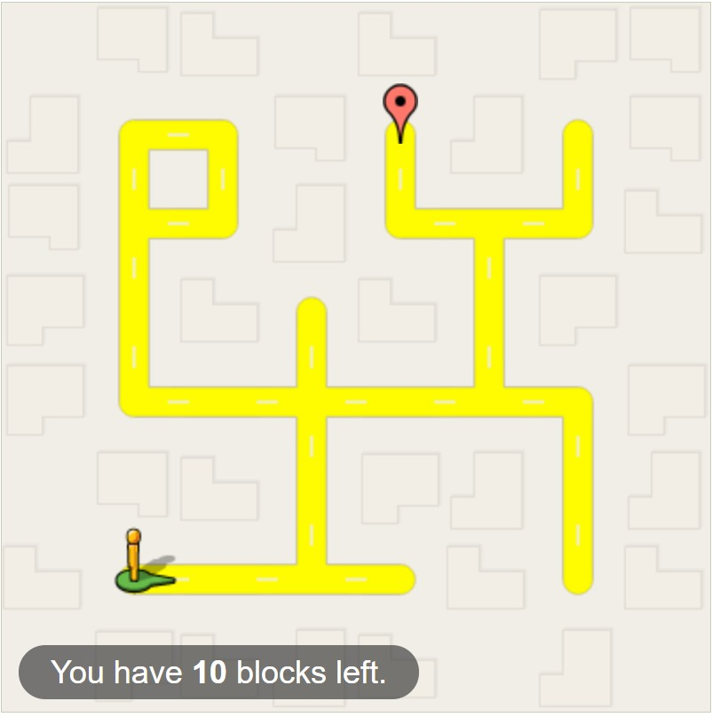
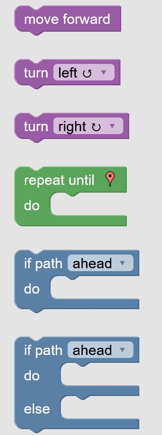
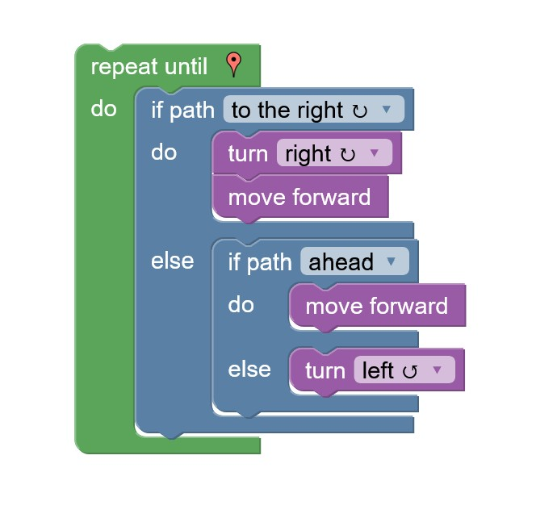

# Manifesto TPC1

## Autora

Beatriz Matos Pereira
A114502

## Resumo
### Ex1. Blockly: Maze

**Descrição do Problema**
Neste primeiro exercício, o objetivo era movimentar o personagem, da forma mais eficiente possível e com acesso apenas a 10 blocos, de modo a que o mesmo chegasse ao destino pretendido.

 

**Abordagem**
Para dar resposta ao problema, foi criado um loop que permite a repetição das instruções até que o personagem chegue ao destino de modo a minimizar o número de blocos usado. Esse loop repete a seguinte série de intruções: 
1. virar à direita caso exista caminho e seguir em frente;
2. caso o primeiro ponto não se verifique, se houver caminho em frente, seguir em frente;
3. caso nenhum dos anteriores se verifique, virar à esquerda.

### Ex2. Boat (Blockly: Turtle)
**Descrição do Problema**

**Abordagem**

## Lista de Resultados

| Exercício | Descrição do artefacto |
| ----------- | ----------- |
| [Ex1.](blockly_maze.js) | Contém blocos convertidos em código JavaScript e link para a resolução no Blockly na forma de comentário.
| [Ex2.] | Text | 

