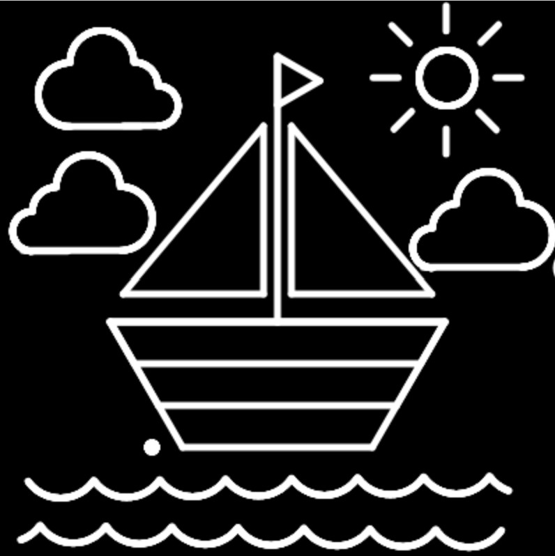
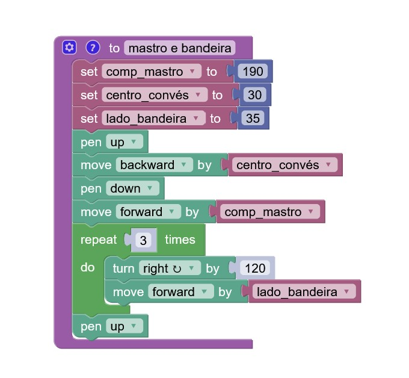
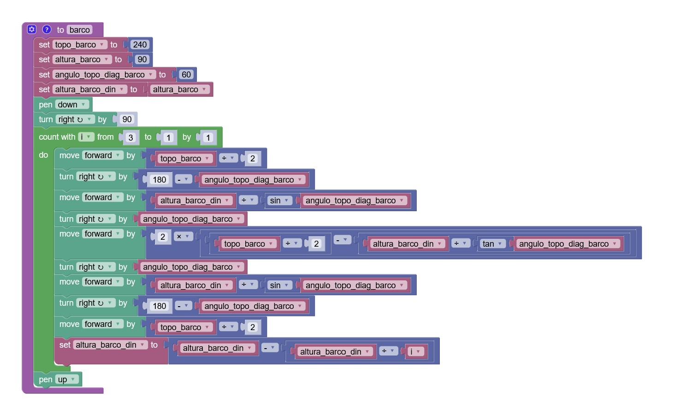
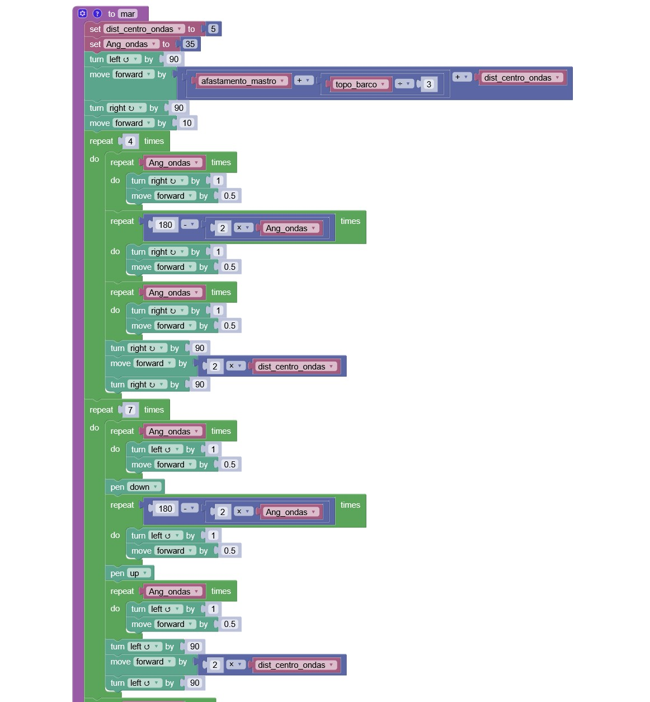
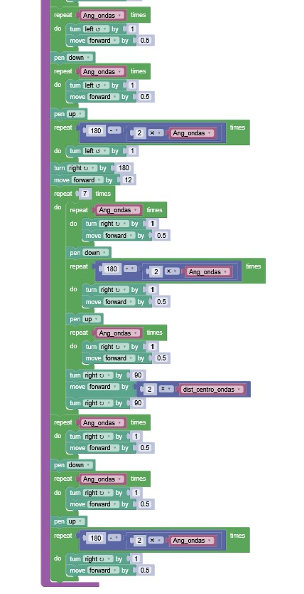
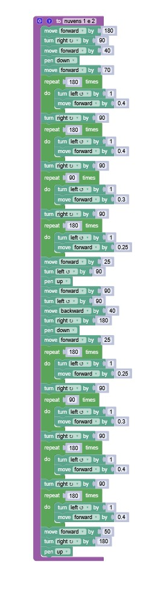
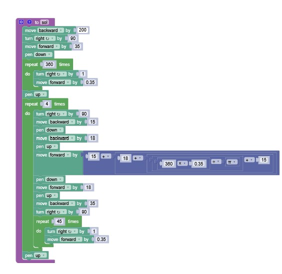
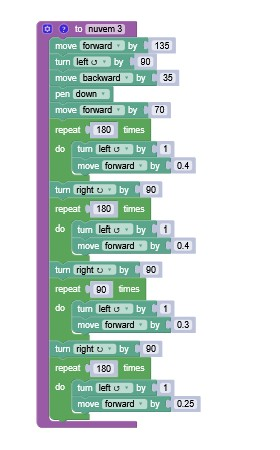

# Ex2. Desenho do Barco (Blockly: Turtle)

## Resultado do Desenho

## Estrutura Principal do Código

### Blocos de cada estrutrura

imagem 1- bloco correspondente ao mastro e à bandeira

imagem 2- bloco correspondente ao barco

 

imagens 3 e 4- bloco correspondente ao mar

 

imagem 5- bloco correspondente às nuvens no lado esquerdo do desenho

 

imagem 6- bloco correspondente ao sol

 

imagem 7-bloco correspondente às nuvem no lado direito do desenho

## Link para o Blockly: Turtle

<https://blockly.games/turtle?lang=en&level=10#h3ipky>